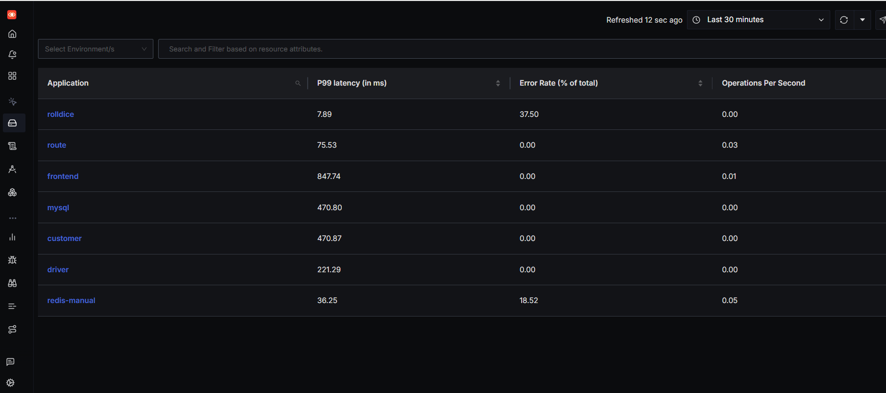
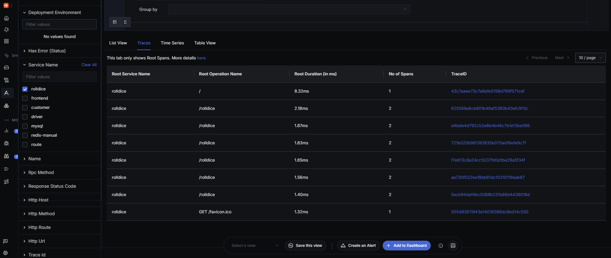
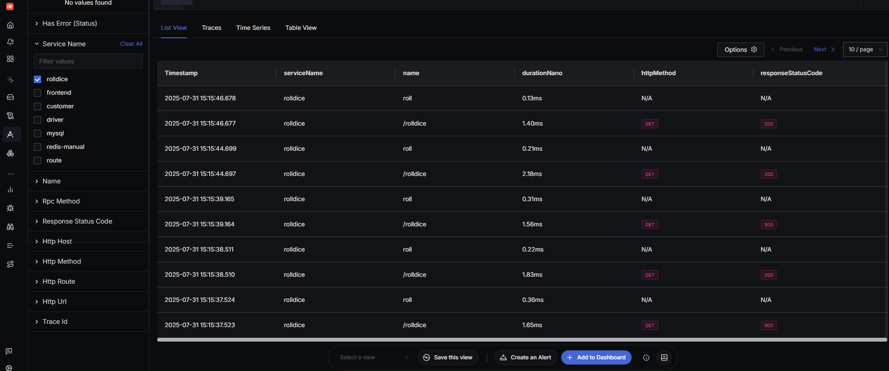
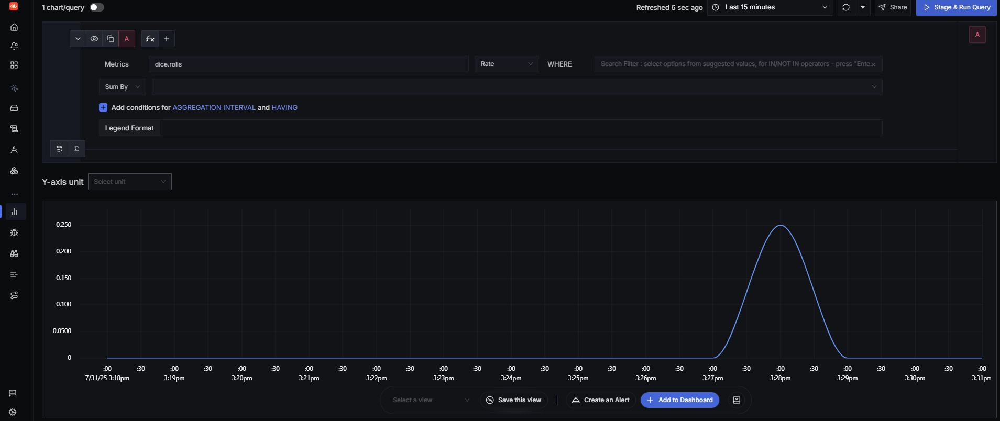
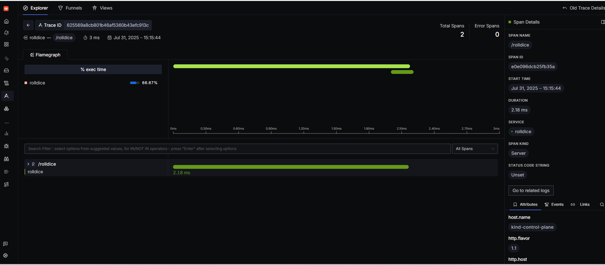
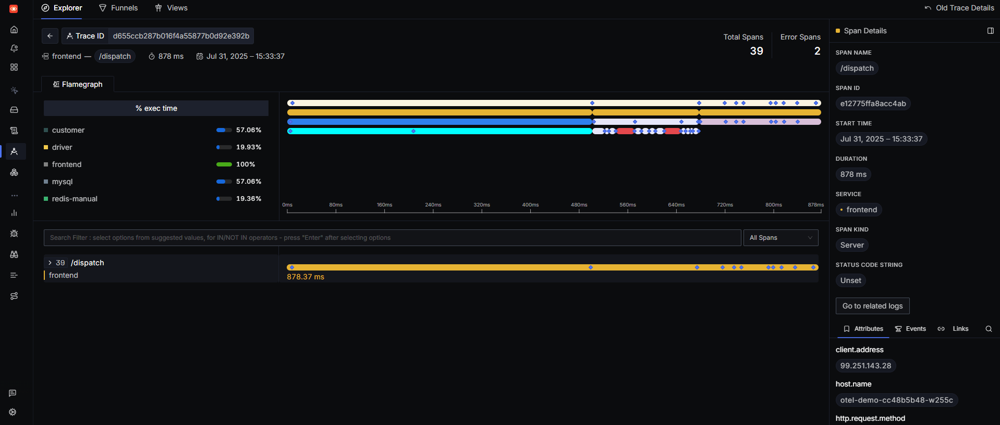
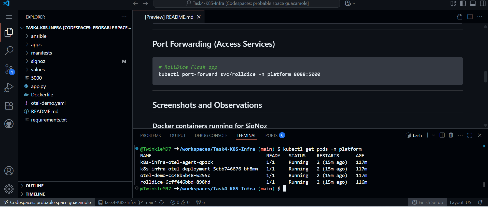

# Task 4 - K8s Infra Monitoring with SigNoz

This project demonstrates how to deploy telemetry infrastructure in Kubernetes using the **SigNoz `k8s-infra` Helm chart**, and send logs, traces, and metrics from your apps to a SigNoz instance running separately via Docker.

---

## Project Goals

1. Run SigNoz stack using Docker Compose
2. Deploy `k8s-infra` Helm chart using Ansible
3. Forward Kubernetes telemetry to SigNoz
4. Monitor `HotROD` demo app and custom `RollDice` Flask app
5. Verify logs, traces, and metrics in SigNoz UI

---

## Prerequisites

```bash
# Clone SigNoz repo and run Docker Compose
git clone https://github.com/SigNoz/signoz.git
cd signoz/deploy/docker
docker-compose up -d

# Return back to the main folder

cd "$(git rev-parse --show-toplevel)"
cd ..
```

---

## Set Up Kubernetes and Ansible

```bash
sudo apt update
sudo apt install -y ansible

# Install kind CLI
curl -Lo ./kind https://kind.sigs.k8s.io/dl/v0.22.0/kind-linux-amd64
chmod +x ./kind
sudo mv ./kind /usr/local/bin/kind

# Create kind cluster
kind create cluster --name kind
kubectl get nodes

# Run Ansible playbook to deploy k8s-infra and apps
ansible-playbook ansible/up.yml
```

---

## Port Forwarding (Access Services)

```bash
# RollDice Flask app
kubectl port-forward svc/rolldice -n platform 8088:5000
```

---

## Screenshots and Observations

### SigNoz Services Overview
Shows detected services (`frontend`, `query-service`, etc.) proving that OpenTelemetry is exporting correctly.


### Trace List View with RollDice Service
Demonstrates that multiple traces are received for the `/dispatch` operation.


### Detailed Trace View (Single RollDice Request)
Drill-down view of a single trace showing span breakdown and timings.


### Custom Metric Name Selection (dice.rolls)
Confirms custom metric `dice.rolls` is successfully pushed to SigNoz.


### RollDice Trace Detail - Waterfall View
Visual representation of spans in the RollDice trace with timestamps and latency.


### HotROD Timeline - Service Activity
Demonstrates high-level timeline view of HotROD spans across services.


### HotROD Trace Detail - Waterfall View
Full breakdown of spans within a single HotROD trace.


### Terminal Output Showing Trace Logs
Terminal output showing that requests and exceptions (if any) are logged and traced.


---

## Tear Down

```bash
ansible-playbook ansible/down.yml
kind delete cluster
docker-compose down
```

---

## References

- [SigNoz GitHub](https://github.com/SigNoz/signoz)
- [OpenTelemetry Collector Helm Chart](https://github.com/open-telemetry/opentelemetry-helm-charts)
